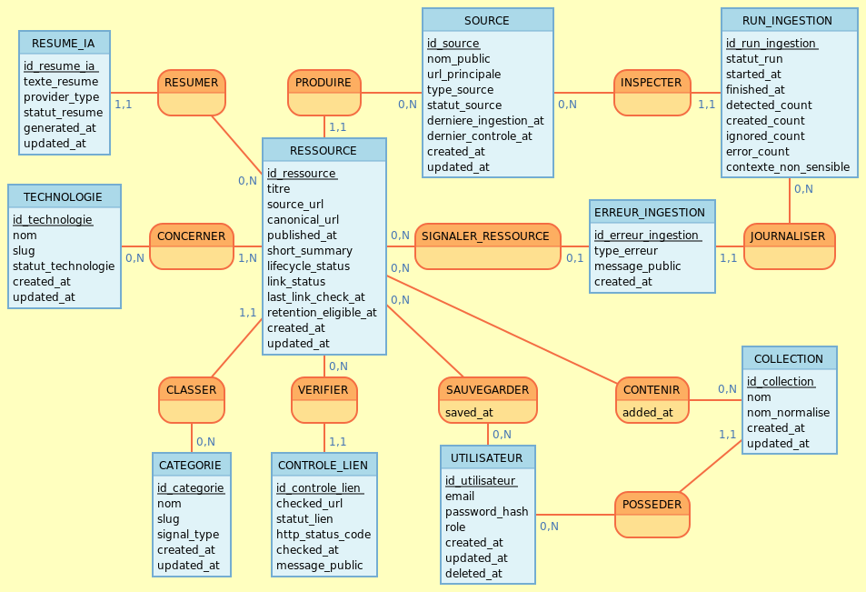

# MCD StackVault

## Objectif

Ce MCD decrit le domaine MVP avant la traduction Prisma. Il sert de source conceptuelle pour les migrations importantes et doit rester synchronise avec le MLD puis `apps/api/prisma/schema.prisma`.

Perimetre couvert :

- consultation publique des ressources techniques ;
- confiance visible : source, URL, categorie, technologie, fraicheur, statut de lien ;
- ingestion depuis sources allowlistees ;
- deduplication par URL canonique ;
- comptes, roles, favoris et collections ;
- retention 90 jours des ressources non sauvegardees ;
- erreurs d'ingestion, controles de liens et resume IA cache.

Hors perimetre conceptuel MVP :

- personnalisation avancee du dashboard par centres d'interet ;
- notifications, digest ou temps reel ;
- stockage persistant du corps complet des contenus tiers ;
- reseaux sociaux ou UGC non modere comme source canonique.

## Glossaire

- Ressource : signal technique affiche par StackVault, toujours relie a une URL source.
- Source : origine allowlistee d'une ressource, par exemple flux RSS, API officielle ou metadata publique.
- URL source : URL visible et ouvrable par l'utilisateur.
- URL canonique : URL normalisee utilisee pour eviter les doublons.
- Technologie : stack, framework, runtime, outil ou ecosysteme concerne par une ressource.
- Categorie : type de signal, par exemple securite, release ou tendance.
- Favori : sauvegarde personnelle d'une ressource par un utilisateur.
- Collection : dossier utilisateur regroupant des ressources sauvegardees ou selectionnees.
- Run d'ingestion : execution d'un job qui tente de collecter ou normaliser des ressources.
- Controle de lien : verification de disponibilite d'une URL source.
- Resume IA : synthese generee a la demande et cachee en base, sans conserver le corps source.

## Entites conceptuelles

### Source

Une source represente une origine autorisee pour alimenter les ressources canoniques du MVP.

Attributs principaux :

- identifiant ;
- nom public ;
- URL principale ;
- type de source : RSS/Atom, API officielle, metadata publique ;
- statut : active, inactive, en erreur, a verifier ;
- date de derniere ingestion ;
- date de dernier controle ;
- date de creation et date de mise a jour.

Regles :

- une ressource canonique MVP doit etre rattachee a une source allowlistee ;
- une source inactive ou en erreur peut rester visible en admin, mais ne doit pas etre presentee comme saine cote public ;
- aucune source sociale ou UGC non moderee ne doit alimenter les ressources canoniques du MVP.

### Ressource

Une ressource est l'unite de lecture affichee dans le dashboard et les fiches publiques.

Attributs principaux :

- identifiant ;
- titre ;
- URL source ;
- URL canonique ;
- date de publication ou de detection ;
- resume court non IA ou description courte ;
- statut de cycle de vie : active, expiree, indisponible, conservee par sauvegarde ;
- statut de lien : inconnu, actif, verifie recemment, indisponible, redirection, en verification ;
- date de dernier controle du lien ;
- date d'eligibilite a retention ;
- date de creation et date de mise a jour.

Regles :

- l'URL source est obligatoire pour toute ressource affichee ;
- l'URL canonique doit etre unique afin d'eviter les doublons ;
- le corps complet d'un contenu tiers ne doit jamais etre stocke ;
- une ressource non sauvegardee est eligible a suppression apres 90 jours ;
- une ressource presente dans un favori ou une collection est protegee de la suppression automatique tant que ce rattachement existe.

### Technologie

Une technologie permet de filtrer, classer et comprendre le domaine technique concerne.

Attributs principaux :

- identifiant ;
- nom ;
- slug stable ;
- statut : active, inactive ;
- date de creation et date de mise a jour.

Regles :

- une ressource peut concerner plusieurs technologies ;
- une technologie peut etre rattachee a plusieurs ressources.

### Categorie

Une categorie qualifie le type de signal affiche.

Attributs principaux :

- identifiant ;
- nom ;
- slug stable ;
- type de signal : securite, release, tendance, autre ;
- date de creation et date de mise a jour.

Regles :

- une ressource publique initiale appartient a une categorie principale ;
- les categories doivent rester administrables plus tard sans casser les ressources existantes.

### Utilisateur

Un utilisateur porte les donnees minimales de compte et les droits d'acces.

Attributs principaux :

- identifiant ;
- email ;
- hash de mot de passe ;
- role : USER ou ADMIN ;
- date de creation, date de mise a jour, date de suppression eventuelle.

Regles :

- les mots de passe ne sont jamais stockes en clair ;
- la suppression de compte doit permettre de supprimer les donnees personnelles, favoris et collections associes ;
- un administrateur est un utilisateur avec role ADMIN, pas une entite separee.

### Favori

Un favori represente la sauvegarde d'une ressource par un utilisateur.

Attributs principaux :

- identifiant ;
- utilisateur ;
- ressource ;
- date de creation.

Regles :

- un utilisateur ne peut avoir qu'un favori par ressource ;
- un favori protege la ressource de la retention automatique ;
- la suppression du favori retire cette protection sauf si une autre collection ou favori protege encore la ressource.

### Collection

Une collection est un dossier personnel cree par un utilisateur.

Attributs principaux :

- identifiant ;
- proprietaire ;
- nom ;
- date de creation et date de mise a jour.

Regles :

- une collection appartient a un seul utilisateur ;
- deux collections d'un meme utilisateur ne devraient pas partager exactement le meme nom normalise ;
- la suppression d'une collection supprime ses rattachements, pas necessairement les ressources.

### Rattachement Collection-Ressource

Ce rattachement relie une collection a une ressource.

Attributs principaux :

- collection ;
- ressource ;
- date d'ajout.

Regles :

- une meme ressource ne doit apparaitre qu'une fois dans une collection donnee ;
- ce rattachement protege la ressource de la retention automatique ;
- une future implementation pourra exiger que la ressource soit aussi favorite avant ajout a une collection.

### Run d'ingestion

Un run d'ingestion trace une execution de collecte ou normalisation pour une source.

Attributs principaux :

- identifiant ;
- source concernee ;
- statut : en cours, succes, succes partiel, echec ;
- date de debut ;
- date de fin ;
- compteur de ressources detectees, creees, ignorees ou en erreur ;
- contexte non sensible.

Regles :

- l'echec d'une source ne doit pas interrompre les autres sources ;
- le run sert au diagnostic admin et ne doit pas exposer de secret.

### Erreur d'ingestion

Une erreur d'ingestion decrit un probleme rencontre pendant un run.

Attributs principaux :

- identifiant ;
- run d'ingestion ;
- source concernee ;
- ressource concernee si elle existe ;
- type d'erreur ;
- message non sensible ;
- date de creation.

Regles :

- le message ne doit pas contenir de token, secret, trace brute ou contenu tiers complet ;
- l'erreur doit rester exploitable en admin pour comprendre quelle source est affectee.

### Controle de lien

Un controle de lien represente une verification d'une URL source.

Attributs principaux :

- identifiant ;
- ressource concernee ;
- URL controlee ;
- statut : actif, indisponible, redirection, inconnu, erreur ;
- code HTTP eventuel ;
- date de controle ;
- message non sensible.

Regles :

- un lien indisponible ne supprime pas automatiquement une ressource sauvegardee ;
- le dernier statut doit pouvoir etre affiche sur carte, fiche et admin.

### Resume IA

Un resume IA est une synthese generee a la demande pour une ressource eligible.

Attributs principaux :

- identifiant ;
- ressource concernee ;
- texte du resume genere ;
- fournisseur ou type de fournisseur ;
- statut : disponible, erreur fournisseur, quota depasse, cle absente, obsolete ;
- date de generation ;
- date de mise a jour.

Regles :

- le resume est distinct du corps source ;
- le fetch du corps source reste ephemere ;
- la fiche ressource doit rester utilisable sans resume IA.
- une ressource peut avoir plusieurs generations de resume dans le temps, par exemple si le fournisseur, le prompt, la langue ou le contenu source evolue ;
- pour le MVP, l'interface consommera au plus un resume courant par ressource, mais le modele conceptuel garde l'historique possible plutot qu'un one-to-one rigide.

## Associations et cardinalites

Notation : `A (min,max) -- relation -- (min,max) B`.

- `Source (0,n) -- produit -- (1,1) Ressource`
  - Une source peut produire zero a plusieurs ressources.
  - Une ressource canonique MVP provient d'une seule source allowlistee.

- `Categorie (0,n) -- classe -- (1,1) Ressource`
  - Une categorie peut classer plusieurs ressources.
  - Une ressource publique initiale possede une categorie principale.

- `Ressource (1,n) -- concerne -- (0,n) Technologie`
  - Une ressource doit concerner au moins une technologie pour les filtres MVP.
  - Une technologie peut n'avoir encore aucune ressource.

- `Utilisateur (0,n) -- sauvegarde -- (1,1) Favori`
  - Un utilisateur peut sauvegarder plusieurs ressources.
  - Un favori appartient a un seul utilisateur.

- `Ressource (0,n) -- est sauvegardee par -- (1,1) Favori`
  - Une ressource peut etre sauvegardee par plusieurs utilisateurs.
  - Un favori cible une seule ressource.

- `Utilisateur (0,n) -- possede -- (1,1) Collection`
  - Un utilisateur peut creer plusieurs collections.
  - Une collection appartient a un seul utilisateur.

- `Collection (0,n) -- contient -- (0,n) Ressource`
  - Une collection peut contenir zero a plusieurs ressources.
  - Une ressource peut etre presente dans plusieurs collections.

- `Source (0,n) -- est inspectee par -- (1,1) Run d'ingestion`
  - Une source peut avoir plusieurs runs.
  - Un run concerne une seule source.

- `Run d'ingestion (0,n) -- journalise -- (1,1) Erreur d'ingestion`
  - Un run peut produire plusieurs erreurs.
  - Une erreur appartient a un seul run.

- `Ressource (0,n) -- rencontre -- (0,1) Erreur d'ingestion`
  - Une erreur peut etre liee a une ressource si la ressource existe deja.
  - Une ressource peut avoir plusieurs erreurs associees.

- `Ressource (0,n) -- est verifiee par -- (1,1) Controle de lien`
  - Une ressource peut avoir plusieurs controles de lien.
  - Un controle concerne une seule ressource.

- `Ressource (0,n) -- possede -- (1,1) Resume IA`
  - Une ressource peut ne pas avoir de resume IA.
  - Une ressource peut conserver plusieurs generations de resume dans le temps.
  - Chaque resume IA appartient a une seule ressource.

## Représentation visuelle du MCD

## Regles transverses

### Provenance et confiance

- Toute ressource publique doit exposer sa source et son URL source.
- Les sources actives doivent appartenir a l'allowlist administree.
- Le statut de source et le statut de lien sont des informations de confiance, pas de simples champs techniques.

### Deduplication

- `canonical_url` est la cle conceptuelle de deduplication des ressources.
- Deux ressources canoniques ne doivent pas partager la meme URL canonique.
- Les differences de casing, trailing slash ou parametres de tracking doivent etre normalisees avant comparaison technique.

### Retention

- Une ressource non sauvegardee devient eligible a suppression apres 90 jours.
- Une ressource rattachee a au moins un favori ou une collection n'est pas supprimee automatiquement.
- La retention est executee par job planifie, jamais au milieu d'une requete utilisateur ordinaire.

### Suppression utilisateur

- La suppression de compte doit supprimer ou anonymiser les donnees personnelles du compte.
- Les favoris et collections de l'utilisateur supprime doivent etre supprimes.
- Les ressources partagees restent conservees si elles sont encore utiles au catalogue public ou sauvegardees par d'autres utilisateurs.

### Non-persistance du corps tiers

- Le modele interdit le stockage du corps complet des contenus tiers.
- Le systeme peut persister des metadonnees, statuts, liens, categories, diffs autorises et resumes IA generes.
- Les erreurs et logs ne doivent pas recopier de contenu tiers complet.

### Resume IA courant

- Le MCD represente plusieurs resumes IA possibles par ressource pour eviter une relation one-to-one trop rigide.
- Le MVP affichera au plus un resume courant par ressource.
- Le MLD devra prevoir une maniere de distinguer le resume courant : champ `is_current`, `superseded_at`, contrainte partielle PostgreSQL ou autre strategie documentee.

## Decisions prises au MLD

- Les statuts sont modelises comme `text` avec valeurs autorisees documentees. Prisma pourra les representer par des enums applicatifs si cela reste plus lisible cote TypeScript.
- `deleted_at` est conserve sur `users` pour representer une suppression ou anonymisation sans casser immediatement les relations. La strategie exacte sera precisee dans les stories auth/suppression de compte.
- L'unicite des collections utilisateur repose sur `normalized_name`, afin d'eviter les doublons differant seulement par casse ou espaces.
- `ai_summaries` garde un historique possible, avec un seul resume courant par ressource via `is_current` et une contrainte unique partielle PostgreSQL recommandee.
- Les statuts de lien, source, cycle de vie, ingestion et resume IA restent normalises par valeurs documentees avant une eventuelle normalisation en tables dediees post-MVP.
